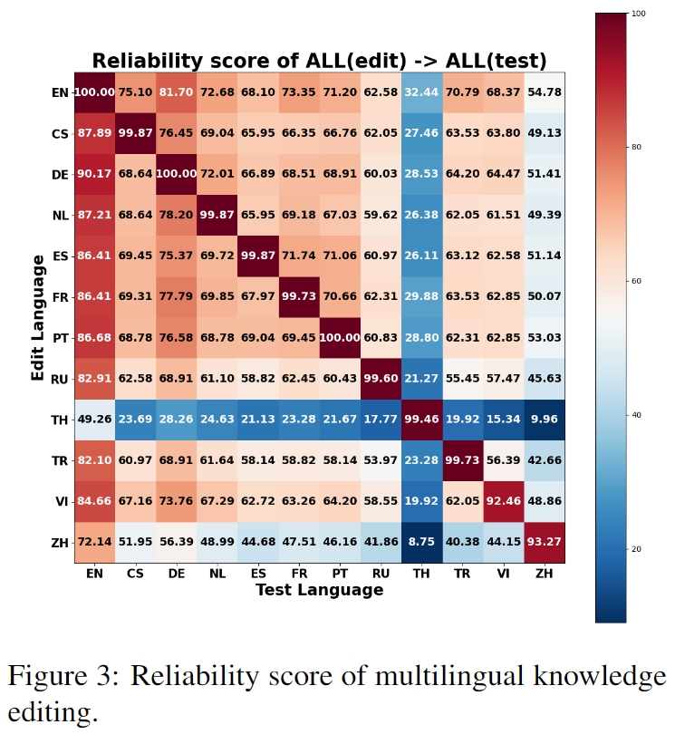

<h1 align=center>Retrieval-Augmented Multilingual Knowledge Editing</h1>

<h3 align=center>Weixuan Wang, Barry Haddow, Alexandra Birch</h3>

<h2 align=center>Abstract</h2>

Knowledge represented in Large Language Models (LLMs) is quite often incorrect and can also become obsolete over time. Updating knowledge via fine-tuning is computationally resource-hungry and not reliable, and so knowledge editing (KE) has developed as an effective and economical alternative to inject new knowledge or to fix factual errors in LLMs. Although there has been considerable interest in this area, current KE research exclusively focuses on the monolingual setting, typically in English. However, what happens if the new knowledge is supplied in one language, but we would like to query the LLM in a different language? To address the problem of multilingual knowledge editing, we propose **Retrieval-augmented Multilingual Knowledge Editor (ReMaKE)** to update new knowledge in LLMs. ReMaKE can perform model-agnostic knowledge editing in multilingual settings. ReMaKE concatenates the new knowledge retrieved from a multilingual knowledge base with prompts. Our experimental results show that ReMaKE outperforms baseline knowledge editing methods by a significant margin and is the first KE method to work in a multilingual setting. We provide our multilingual knowledge editing dataset (MzsRE) in 12 languages, which along with code, and additional project information is available at https://github.com/weixuan-wang123/ReMaKE .


<h2 align=center>Research Question</h2>

Despite LLMs' considerable progress, facts induced by LLMs can be incorrect or become obsolete in a changing world. Pre-training from scratch or fine-tuning LLMs to adapt them to new knowledge is computationally expensive and not guaranteed to work. For example, KE could be used to correct the answer to this question *"Who is the foreign secretary of the UK?"* from *"James Cleverly"* (true until mid November 2023) to *"David Cameron"*, who has recently been appointed to the post.


<h2 align=center>Methodology</h2>

<table align="center">
<tr>
  <td width="80%" align="center" valign="middle"></td>
</tr>
</table>


**Multilingual Knowledge Editor (ReMaKE)** combines multilingual retrieval from a knowledge base with in-context learning. This leverages the advantages of a knowledge bases’ ability to scale and IKE’s knowledge editing performance. ReMaKE concatenates the retrieved knowledge with the user query to create the prompt. The retrieval process is critical to alleviate the negative effects of unrelated information as the developed multilingual retriever can extract information highly relevant to user inputs, largely removing the contextual interference due to irrelevant facts. Furthermore, the retriever will only return knowledge if it is related to the query, greatly reducing the impact of KE on unedited knowledge.

<h3 align=center>Zero-shot and Few-shot Editing</h3>


<table align="center" align="center">
<tr>
  <td width="80%" align="center" valign="middle"></td>
</tr>
</table>


<h2 align=center>Dataset (MzsRE)</h2>

<table align="center">
<tr>
  <td width="80%" align="center" valign="middle"></td>
</tr>
</table>

<h2 align=center>Experiments</h2>


<h3 align=center>Editing in English</h3>

<table align="center">
<tr>
  <td width="80%" align="center" valign="middle"></td>
</tr>
</table>

<h3 align=center>Editing in Non-English</h3>

<table align="center">
<tr>
  <td width="80%" align="center" valign="middle"></td>
</tr>
</table>

<h3 align=center>Multilingual Editing</h3>

<table align="center" align="center">
<tr align="center">
  <td width="50%" align="center" valign="middle"></td>
  <td width="50%" align="center" valign="middle"></td>
</tr>
</table>

<h3 align=center>Ablation Study </h3>

<table align="center" align="center">
<tr align="center">
  <td width="50%" align="center" valign="middle"></td>
  <td width="50%" align="center" valign="middle"></td>
</tr>
</table>


<h2 align=center>Bibtex</h2>

```
@article{wang2023retrievalaugmented,
  title={Retrieval-augmented Multilingual Knowledge Editing}, 
  author={Weixuan Wang and Barry Haddow and Alexandra Birch},
  journal={arXiv preprint arXiv:2312.13040},
  year={2023}
}
```
